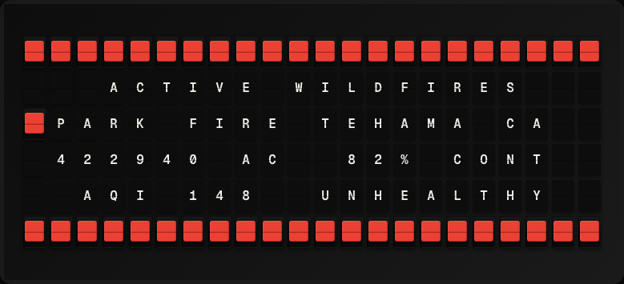

# Wildfire Tracker Plugin

Display active wildfire incidents from the National Interagency Fire Center (NIFC).



**→ [Setup Guide](./docs/SETUP.md)**

## Overview

The Wildfire Tracker plugin queries the NIFC ArcGIS REST API for active wildfire incidents in the United States. It shows the largest or most recently updated incident, including acreage and containment percentage. No API key required.

## Template Variables

| Variable | Description | Example |
|---|---|---|
| `wildfire.fire_name` | Name of the largest active fire | `Caldor Fire` |
| `wildfire.state` | State where the fire is located | `CA` |
| `wildfire.acres` | Acres burned (most recent estimate) | `28,000` |
| `wildfire.containment` | Percent containment | `42%` |
| `wildfire.active_count` | Total number of active fires in the query result | `15` |

## Example Templates

```
WILDFIRES
{{wildfire.fire_name}}
{{wildfire.state}} - {{wildfire.acres}} ac
Contained: {{wildfire.containment}}
Active fires: {{wildfire.active_count}}

```

## Configuration

| Setting | Name | Description | Required |
|---|---|---|---|
| `state` | US State Filter | Two-letter state code to filter by (leave empty for nationwide). | No |

## Features

- NIFC ArcGIS real-time fire data
- Largest active fire display
- Acreage and containment percentage
- Optional state filter
- No API key required

## Author

FiestaBoard Team
